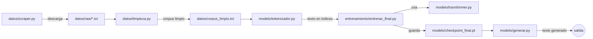

# mini-llm-desde-cero

Modelo de lenguaje entrenado **desde cero**, sin APIs de pago ni datasets preparados: scraping propio, tokenizador, dos arquitecturas (LSTM y Transformer) y bucle de entrenamiento, todo implementado y explicado paso a paso como proyecto de aprendizaje.

## Qué es esto (y qué no es)

Un modelo de lenguaje a nivel carácter, entrenado sobre ~2,7 millones de caracteres de texto en español (*Don Quijote de la Mancha* + *Vida de Don Quijote y Sancho*, de dominio público), con una arquitectura Transformer decoder-only de ~824K parámetros.

**No** es un competidor de ChatGPT ni pretende serlo. El objetivo explícito del proyecto es entender, construyendo cada pieza a mano, cómo funciona un LLM por dentro: scraping, limpieza de datos, tokenización, embeddings, self-attention, entrenamiento por lotes, evaluación y generación. La escala es deliberadamente pequeña para que todo el ciclo de entrenamiento sea reproducible en una CPU normal en un par de horas.

## Arquitectura y flujo de datos



Resumen en una frase: *scraper → limpieza → corpus → tokenizador (texto↔números) → entrenamiento por lotes sobre el Transformer → checkpoint → generación de texto nuevo*.

## Estructura del proyecto

```
mini-llm-desde-cero/
├── datos/
│   ├── scraper.py        # descarga libros de dominio publico (Project Gutenberg)
│   ├── limpieza.py        # recorta boilerplate legal, normaliza y filtra el vocabulario
│   └── corpus_limpio.txt  # (generado, no versionado) corpus final de entrenamiento
├── modelo/
│   ├── tokenizador.py     # texto <-> indices, a nivel caracter
│   ├── embeddings_demo.py # demo didactica: indices -> vectores con nn.Embedding
│   ├── lstm.py            # arquitectura recurrente (primera version funcional)
│   ├── transformer.py     # arquitectura final: self-attention causal, estilo mini-GPT
│   ├── generar.py         # CLI de inferencia: carga un checkpoint y genera texto
│   └── checkpoint_final.pt # (generado, no versionado) pesos entrenados
├── entrenamiento/
│   ├── entrenar.py        # prueba de concepto: LSTM vs Transformer sobre corpus de juguete
│   └── entrenar_final.py  # entrenamiento real: batching, train/val split, checkpoints
├── requirements.txt
└── .gitignore
```

## Las 8 fases del aprendizaje

| # | Fase | Qué demuestra |
|---|------|----------------|
| 1 | Regresion lineal a mano (NumPy) | El ciclo forward -> loss -> gradiente -> actualizacion, base de todo lo demas |
| 2 | Modelo de n-gramas | Que es "modelar lenguaje" sin redes neuronales, y su limite (el problema de los ceros) |
| 3-4 | Tokenizador + embeddings (PyTorch) | Texto -> numeros -> vectores entrenables; primer contacto con autodiff |
| 5 | LSTM | Arquitectura secuencial con estado oculto; overfitting visible en un corpus pequeño |
| 6 | Transformer | Self-attention paralela, embeddings posicionales, mascara causal |
| 7 | Scraping + limpieza | Obtencion y preparacion de un corpus real y legal (Project Gutenberg) |
| 8 | Entrenamiento final | Batching, train/val split, perplejidad, checkpoints, generacion con temperatura/top-k |

## Resultados obtenidos

Entrenamiento del Transformer: 10.000 iteraciones, ~2h 15min en CPU (sin GPU).

| Iteracion | Train loss | Val loss | Perplejidad (val) |
|---|---|---|---|
| 1 | 3.93 | 3.94 | 51.20 |
| 5.000 | 1.46 | 1.63 | 5.08 |
| 10.000 | 1.34 | 1.52 | 4.58 |

Con top-k y temperatura baja (`--temperatura 0.6 --top-k 10`) en `generar.py`, el texto generado usa vocabulario y ortografia correctos del Quijote, aunque sin coherencia de frase mas alla de fragmentos cortos — esperable dado el tamaño del modelo (824K parametros, ventana de contexto de 128 caracteres) frente a un LLM real (miles de millones de parametros, contextos de miles de tokens).

## Como ejecutarlo

```powershell
python -m venv venv
.\venv\Scripts\Activate.ps1
pip install -r requirements.txt

# 1. Obtener y limpiar los datos
python datos/scraper.py
python datos/limpieza.py

# 2. Entrenar (prueba corta primero)
cd entrenamiento
$env:PRUEBA_RAPIDA="1"; python entrenar_final.py
Remove-Item Env:\PRUEBA_RAPIDA
python entrenar_final.py   # entrenamiento completo, ~2h en CPU

# 3. Generar texto con el modelo entrenado
cd ../modelo
python generar.py --texto "don quijote" --temperatura 0.6 --top-k 10
```

## Decisiones de diseño clave

- **Tokenizacion a nivel caracter** (no palabra ni BPE): vocabulario minimo (56 simbolos) y sin problema de palabras desconocidas, a cambio de secuencias mas largas y de que el modelo deba aprender a "deletrear".
- **Vocabulario filtrado en la limpieza**: se restringe a un conjunto fijo de caracteres para mantener la tabla de embeddings pequeña y evitar que simbolos raros (ruido del formato original) infecten el vocabulario.
- **LSTM antes que Transformer**: construida deliberadamente como paso intermedio, para poder comparar ambas arquitecturas con el mismo corpus y entender *por que* el Transformer es una mejora, no solo adoptarlo porque es lo habitual.
- **Entrenamiento por lotes con muestreo aleatorio** en vez de "una epoca = una pasada": necesario porque el corpus (millones de caracteres) no cabe en una sola secuencia de entrada.
- **Checkpoint periodico** (no solo al final): el entrenamiento tarda horas en CPU; guardarlo cada pocas iteraciones evita perder el progreso ante una interrupcion.

## Limitaciones conocidas y posibles mejoras

- **Escala**: 824K parametros y 128 caracteres de contexto limitan fuertemente la coherencia del texto generado.
- **Corpus pequeño** (2,7M caracteres): la brecha entre train loss y val loss sugiere que mas datos (mas libros de Gutenberg) mejorarian la generalizacion.
- **Tokenizacion a nivel caracter**: una tokenizacion por subpalabras (BPE) reduciria la longitud efectiva de secuencia necesaria para decir lo mismo — la mejora estructural mas relevante, y la mas cercana a como funcionan los LLMs reales.
- **Sin decaimiento del learning rate**: un *scheduler* (ej. cosine decay) probablemente bajaria algo mas el loss en la recta final del entrenamiento.
- **Hardware**: entrenado en CPU (GPU AMD sin soporte CUDA/ROCm fiable en Windows); una GPU NVIDIA o Google Colab reducirian el tiempo de entrenamiento de horas a minutos.

## Stack

Python, PyTorch (arquitectura, autodiff, entrenamiento), NumPy (ejercicios de la Fase 1), Requests (scraping).